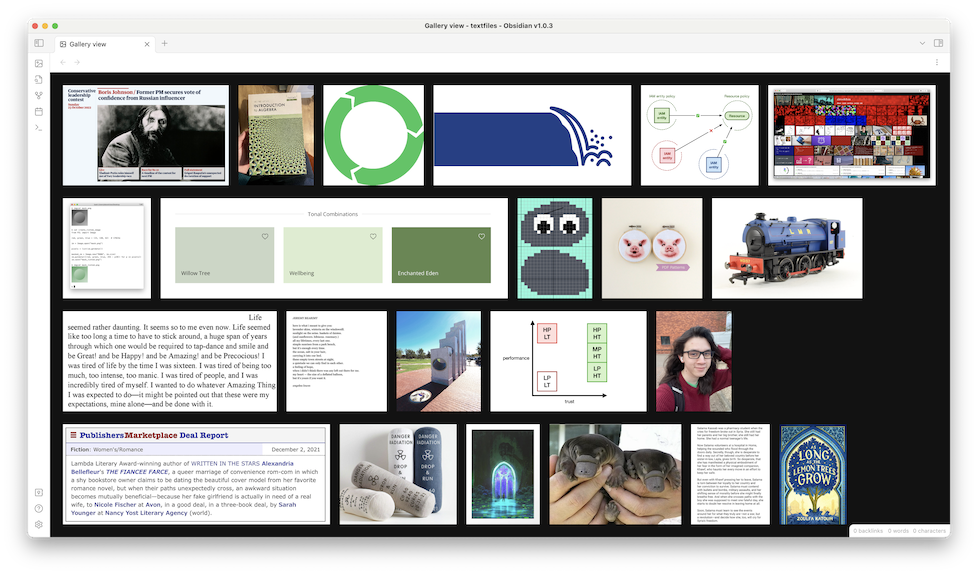

# Obsidian simple gallery

This is a gallery plugin for Obsidian (<https://obsidian.md>).
It adds a "gallery" button to the ribbon, and when you click it you see a grid of all the images in your vault:

There are other image gallery plugins which have more features; I wrote this because I wanted something super-duper simple and I wanted to learn how to write Obsidian plugins.

## Installation

- Copy over `main.js`, `styles.css`, `manifest.json` to your vault `VaultFolder/.obsidian/plugins/simple-gallery/`.
